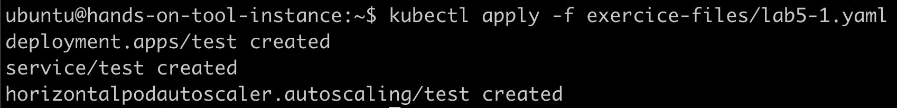
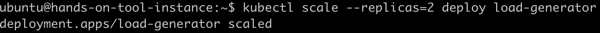
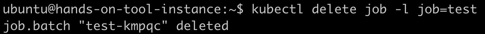

# Autoscaling pods and nodes
## Create a deployment with associated HPA

```
kubectl apply -f exercice-files/lab5-1.yaml
```



## Trigger load on deployment

```
kubectl apply -f exercice-files/lab5-2.yaml
```


## Observe HPA

```
kubectl get hpa test -w
```


Exit with `Ctrl+C`

```
kubectl get pods
```


## Increase load

```
kubectl scale --replicas=2 deploy load-generator
```



## Observe cluster autoscaling

```
kubectl get pods
```


In the Scaleway Console, check Kapsule cluster pools


## Clean up

```
kubectl delete -f exercice-files/lab5-1.yaml -f exercice-files/lab5-2.yaml
```


## Trigger job on specific pool

```
kubectl create -f exercice-files/lab5-3.yaml
```


## Observe cluster autoscaling

```
kubectl get job,pods -l job=test
```


In the Scaleway Console, check Kapsule cluster pools


## Clean up

```
kubectl delete job -l job=test
```


