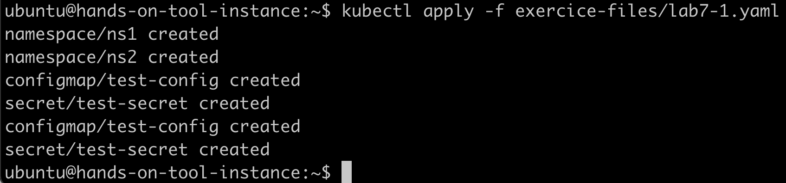
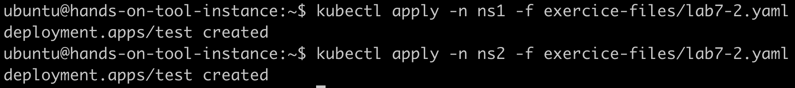
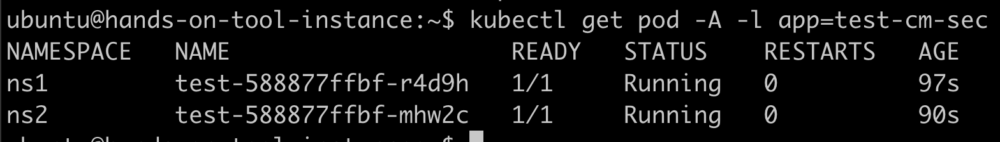
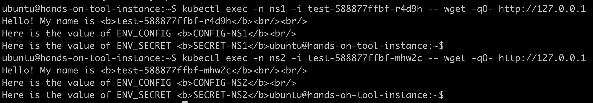
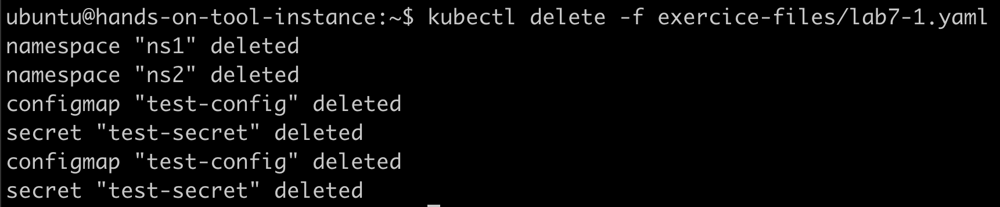

# ConfigMap and Secret
## Create configmap and secret

```
kubectl apply -f exercice-files/lab7-1.yaml
```



## Create same deployment in both namespace

```
kubectl apply -n ns1 -f exercice-files/lab7-2.yaml
```

```
kubectl apply -n ns2 -f exercice-files/lab7-2.yaml
```



## Check applications

```
kubectl get pod -A -l app=test-cm-sec
```



```
kubectl exec -n {NAMESPACE} -i {POD NAME} -- wget -qO- http://127.0.0.1
```



## Cleanup

```
kubectl delete -f exercice-files/lab7-1.yaml
```



(Deleting a namespace trigger deletion of its resource)
