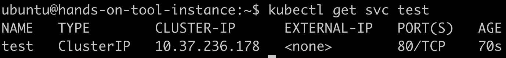

# Ingresses and TLS

## Install Ingress Controller

```
helm upgrade --install ingress-nginx ingress-nginx --repo https://kubernetes.github.io/ingress-nginx --namespace ingress-nginx --create-namespace --values=exercice-files/lab6-values.yaml
```


## Install Cert-Manager

```
kubectl apply -f https://github.com/cert-manager/cert-manager/releases/download/v1.12.0/cert-manager.yaml
```


## Create Let's encrypt issuer

```
sed -i 's/EMAIL/{YOUR_EMAIL_HERE}' exercice-files/lab6-1.yaml
```

```
kubectl apply -f exercice-files/lab6-1.yaml
```


## Deploy demo application

```
kubectl apply -f exercice-files/lab6-2.yaml
```


```
kubectl get svc test
```



## Generate ingress LB FQDN

```
export LB_DNS=$(kubectl get svc ingress-nginx-controller -n ingress-nginx -ojsonpath='{.status.loadBalancer.ingress[0].ip}' | tr . -).lb.fr-par.scw.cloud
```

## Create ingress

```
sed -i "s/HOST/$LB_DNS/g" exercice-files/lab6-3.yaml
```

```
kubectl apply -f exercice-files/lab6-3.yaml
```


## Test LB address

(It may take a few minutes before Let's Encrypt issue the TLS certificate, due to rate limit)


# Cleanup

```
kubectl delete -f exercice-files/lab6-3.yaml -f exercice-files/lab6-2.yaml
```


