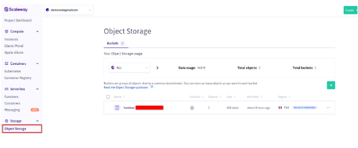
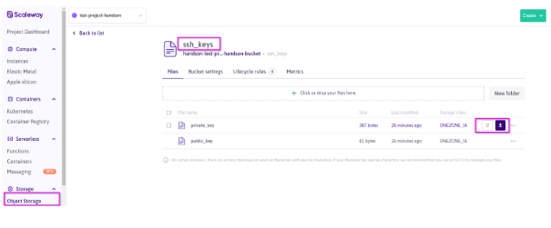

# Attendee Materials

This Hands-on requires the attendee to have the software to establish a SSH connection with that instance on the default port 22. <br />
e.g.:
  - **Linux Based OS**
    - SSH client
    - scp client 
  - **Windows**
    - Putty
    - Kitty
    - Mobaxterm
    - …
  
# Attendee Environment
## Overview

- A **Scaleway instance (Ubuntu)**  will be provided to each attendee with the following tools pre installed : 
  - Docker
  - Kubectl
  - Helm
  - [Scaleway CLI](https://github.com/scaleway/scaleway-cli/tree/master)
- Scaleway Container Registry to hold attendee docker image
- Scaleway Kapsule
- An Object Storage that hold SSH Materials to connect to tool Instance
- Scaleway Secret Manager access
- Scaleway Cockpit

**NB:** The Tool instance has also be pre configured with environment variables to ease your connection to your Container Registry and scaleway CLI usage (see below). The Kapsule cluster kubeconfig file is also already downloaded.


|Variable|Description|Purpose|
|--|--|--|
| SCW_REGISTRY_NAME | Container Registry Name | Docker connection|
| SCW_REGISTRY_SERVER | Registry Server url  |Docker connection|
| SCW_REGISTRY_ENDPOINT | Registry endpoint (concat of server and name) |Docker connection|
| SCW_SECRET_KEY | CLI Credentials |CLI configuration|
| SCW_ACCESS_KEY | CLI Credentials |CLI configuration|
| SCW_DEFAULT_ORGANIZATION_ID | Scaleway Organization |CLI configuration|
| SCW_DEFAULT_PROJECT_ID | Scaleway Attendee Project |CLI configuration|

## Tool Instance SSH Connection

1. Connect to your Scaleway Console 
2. Pick the project that is assigned to you according to the guide and information we previously provided
3. Retrieve Scaleway hands-on Tool instance (hands-on-tool-instance) public IP (See below)

4. Download your SSH keys Materials from the dedicated hands-on Object Storage (handson-${project_name}) i.e. : Prefix ssh_keys


5. Connect to your Scaleway instance using your SSH Client
- **Linux Based OS**
```
ssh -i ~/Downloads/private_key ubuntu@${TOOL_PUBLIC_IP}
```
**NB** : If you have error about permissions on the file you should execute the following command to update your private key permissions.
```
chmod 600 ~/Downloads/private_key
```
- **Windows Based OS**

**You may connect to your instance using your favorite SSH Client.**

## Kubectl setup validation
```
kubectl version
```


```
kubectl get nodes
```

