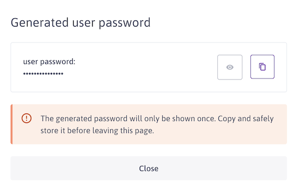
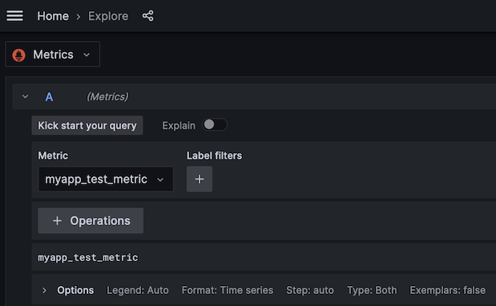

# Bonus Stage: Application Metrics
## Deploy demo application

```
kubectl apply -f exercice-files/lab9-1.yaml
```


## Query Metrics endpoint

```
kubectl run -i --rm --restart=Never --image=busybox:latest shell -- wget -qO- http://test-metrics:9001
```


## Apply prometheus agent manifest

Generate a token to push metrics


Fill the token in manifest

```
sed -i 's/COCKPIT/{YOUR TOKEN}/g' exercice-files/lab9-2.yaml
```


```
kubectl apply -f exercice-files/lab9-2.yaml
```


## Check cockpit for metrics

Login using a new grafana user





Search for metrics



