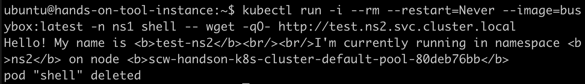
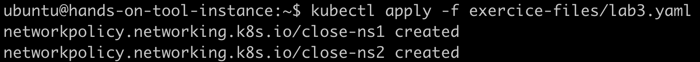
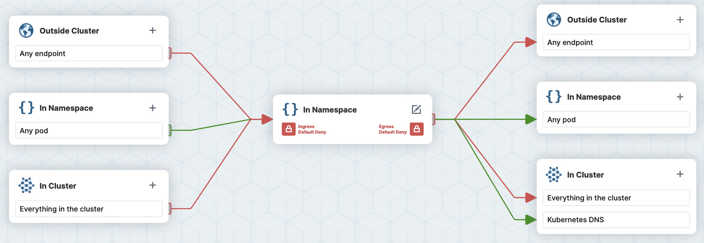
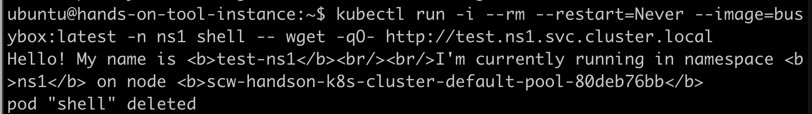
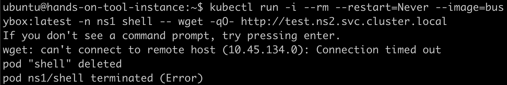

# Securing Namespaces with Network Policies
## Test existing connectivity

```
kubectl run -i --rm --restart=Never --image=busybox:latest -n ns1 shell -- wget -qO- http://test.ns2.svc.cluster.local
```



## Apply demo network policy

```
kubectl apply -f exercice-files/lab3.yaml
```



This demo policy has been built using a GUI available here: [https://editor.networkpolicy.io/](https://editor.networkpolicy.io/)



## Test new connectivity

```
kubectl run -i --rm --restart=Never --image=busybox:latest -n ns1 shell -- wget -qO- http://test.ns1.svc.cluster.local
```



```
kubectl run -i --rm --restart=Never --image=busybox:latest -n ns1 shell -- wget -qO- http://test.ns2.svc.cluster.local
```


