# Securing Namespaces with RBAC
## Create 2 namespaces and associated resources

```
kubectl apply -f exercice-files/lab2-1.yaml
```
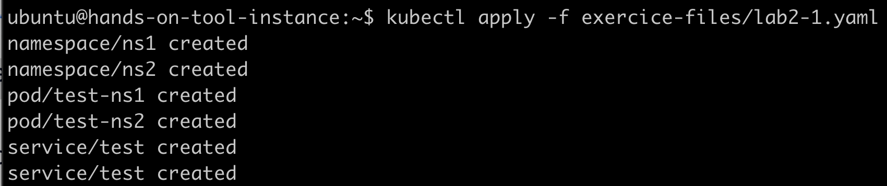

## Check access with existing kubeconfig

```
kubectl get pods -A -l 'run=test'
```
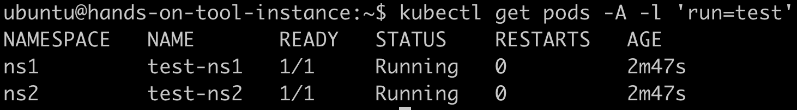

## Create demo RBAC

```
kubectl apply -f exercice-files/lab2-2.yaml
```

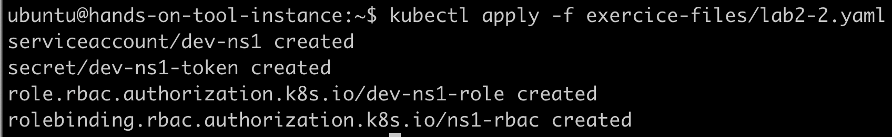

## Update kubeconfig

```
cat<<EOF>>.kube/config
- name: dev-ns1
  user:
    token: $(kubectl get secret dev-ns1-token -n ns1 -ojsonpath="{.data.token}" | base64 -d)
EOF
```

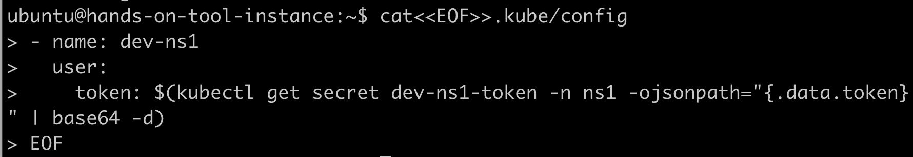

```
kubectl config set-context 'dev-ns1@handson-k8s-cluster' --cluster='handson-k8s-cluster' --namespace='ns1' --user='dev-ns1'
```

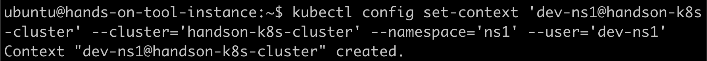

## Check access with created access

```
kubectl config use-context 'dev-ns1@handson-k8s-cluster'
```

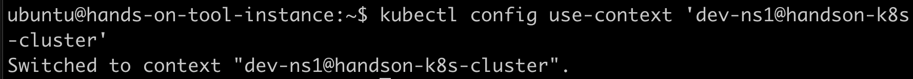

```
kubectl get pods -A -l 'run=test'
```

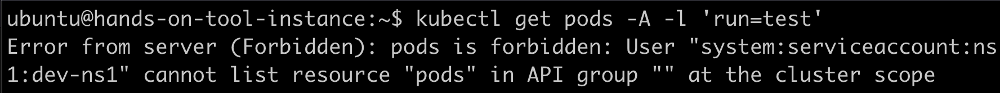

```
kubectl get pods -n ns2 -l 'run=test'
```

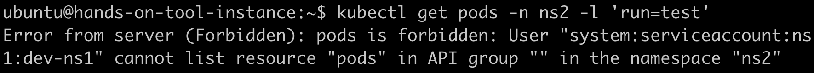

```
kubectl get pods,svc
```

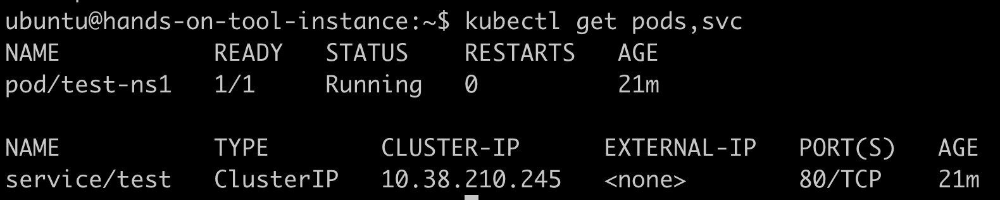

```
kubectl logs test-ns1
```

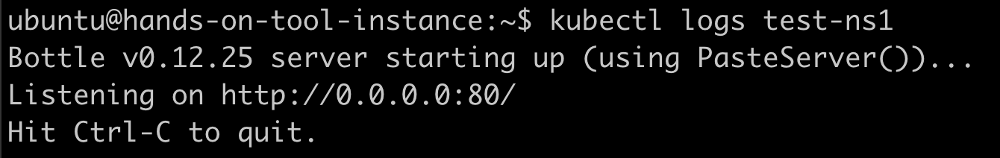

```
kubectl exec test-ns1 -- /bin/sh
```

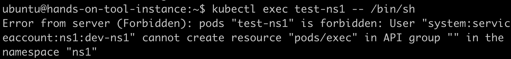

## Switch back to admin kubeconfig

```
kubectl config use-context 'admin@handson-k8s-cluster'
```

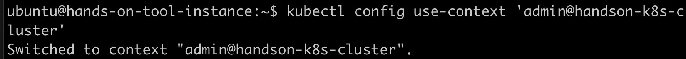
