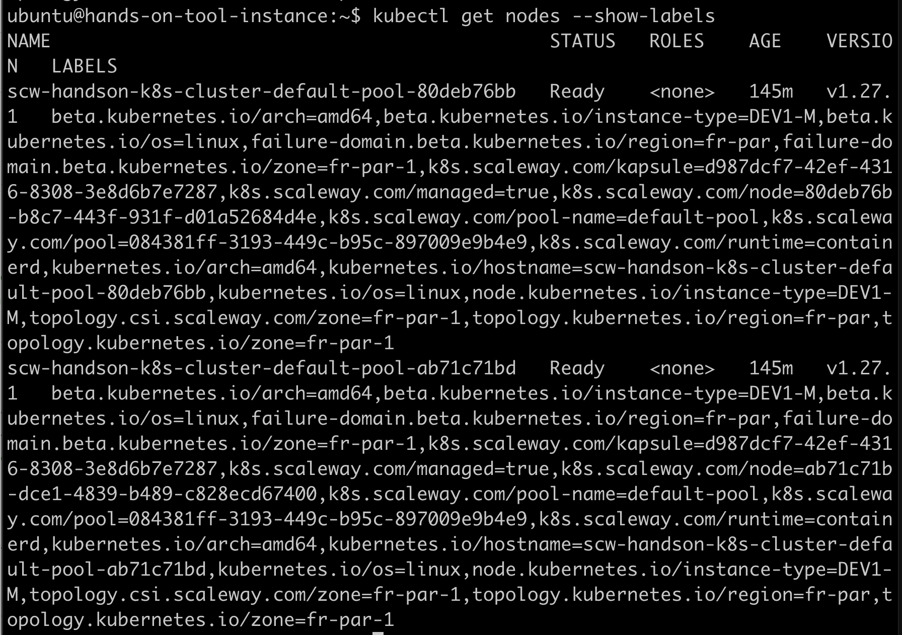
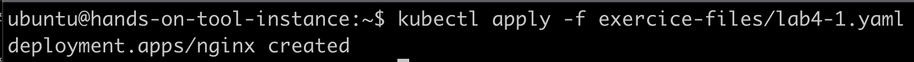
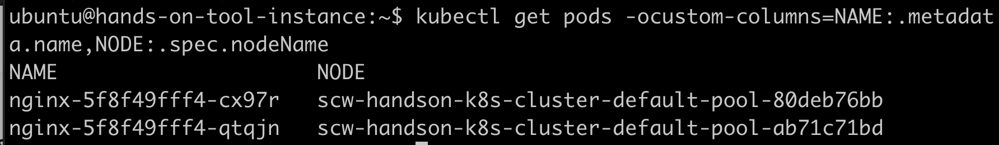
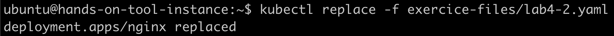
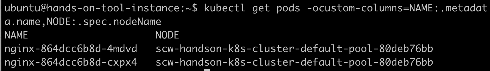
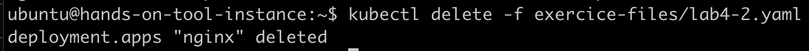

# Scheduling pods - affinity pattern
## Check node labels

```
kubectl get nodes --show-labels
```




## Create new deployment without affinity

```
kubectl apply -f exercice-files/lab4-1.yaml
```



## Check pods location

```
kubectl get pods -ocustom-columns=NAME:.metadata.name,NODE:.spec.nodeName
```



## Recreate deployment with affinity

```
kubectl replace -f exercice-files/lab4-2.yaml
```



## Check pods location

```
kubectl get pods -ocustom-columns=NAME:.metadata.name,NODE:.spec.nodeName
```




## Clean up

```
kubectl delete -f exercice-files/lab4-2.yaml
```



To go further check [the official documentation](https://kubernetes.io/docs/concepts/scheduling-eviction/assign-pod-node/)
