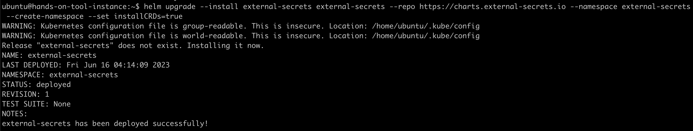
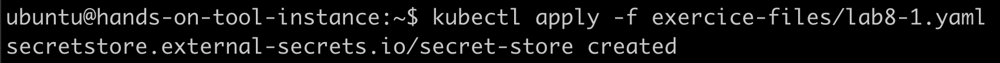
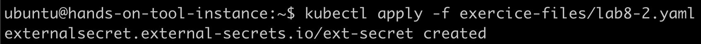
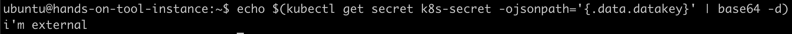

# External Secrets
## Install External Secret Operator using Helm

```
helm upgrade --install external-secrets external-secrets --repo https://charts.external-secrets.io --namespace external-secrets --create-namespace --set installCRDs=true
```



## Create secret store

```
echo -n "$SCW_ACCESS_KEY" > ./access-key
echo -n "$SCW_SECRET_KEY" > ./secret-key
kubectl create secret generic scwsm-secret --from-file=./access-key --from-file=./secret-key
rm -f ./access-key ./secret-key
```

```
sed -i "s/PROJECT/$SCW_DEFAULT_PROJECT_ID/g" exercice-files/lab8-1.yaml
```

```
kubectl apply -f exercice-files/lab8-1.yaml
```



## Configure external secret

```
sed -i "s/SECRETID/$(scw secret secret list | grep demo-kube | awk '{print $1}')/g" exercice-files/lab8-2.yaml
```

```
kubectl apply -f exercice-files/lab8-2.yaml
```



## Check value of synchronized secret

```
echo $(kubectl get secret k8s-secret -ojsonpath='{.data.datakey}' | base64 -d)
```



